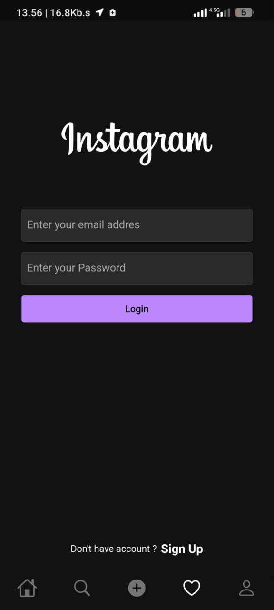
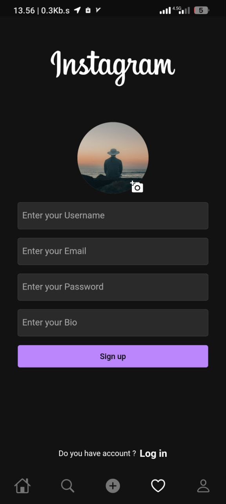

<div align="center">


<br/>


</div>

---

## 📱 App Overview

A **full-featured Instagram clone** built entirely with Flutter and Firebase. This project demonstrates real-world app development skills including real-time data, media uploads, user authentication, and social interactions — all from a single Flutter codebase.

🔗 [**View on GitHub**](https://github.com/AchkanDev/Instagram_with_fireBase)

---

## 🖼️ Screenshots

<div align="center">

| Feed | Profile | Post | Stories |
|------|---------|------|---------|
|  |  |  |  |

</div>

---

## ✨ Implemented Features

- 📸 **Photo Feed** — Real-time post feed with infinite scroll
- ❤️ **Like & Comment** — Firestore-powered social interactions
- 👤 **User Profiles** — Follow/unfollow, bio, post gallery
- 🔍 **Search** — Find users and content
- 📤 **Post Upload** — Camera & gallery with Firebase Storage
- 🔥 **Real-time Updates** — Live Firestore streams
- 🔐 **Auth** — Email and Google sign-in via Firebase Auth
- 📩 **Direct Messages** — Real-time chat between users

---

## 🏗️ Architecture & Tech Stack

```
lib/
├── features/
│   ├── auth/          # Login, Register, Profile setup
│   ├── feed/          # Home feed with real-time posts
│   ├── post/          # Create/view/like/comment
│   ├── profile/       # User profile & followers
│   └── search/        # Discover users & posts
└── core/              # Firebase config, theme, utils
```

| Service | Usage |
|---------|-------|
| **Firebase Auth** | User authentication |
| **Cloud Firestore** | Posts, likes, comments, follows |
| **Firebase Storage** | Image uploads |
| **Firebase Messaging** | Push notifications |

---

<div align="center">

[](https://github.com/AchkanDev/Instagram_with_fireBase)
[](https://github.com/AchkanDev)


</div>
